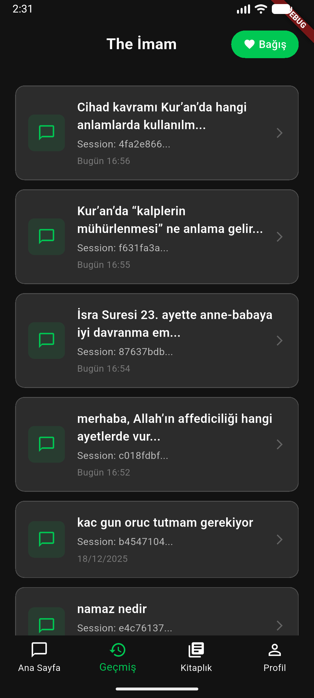
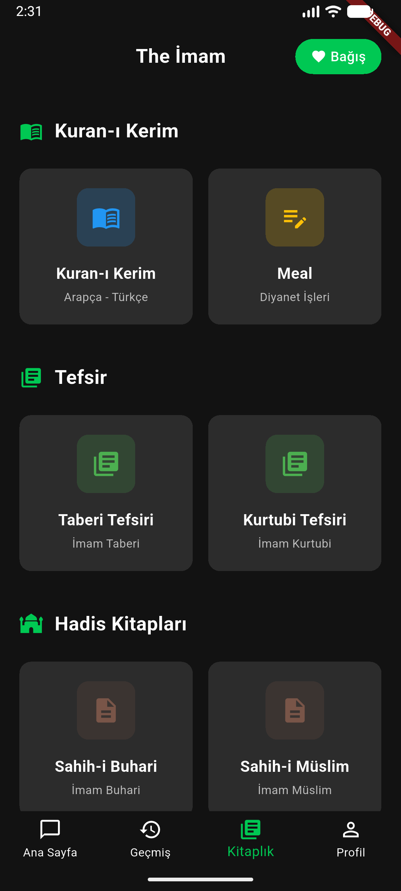
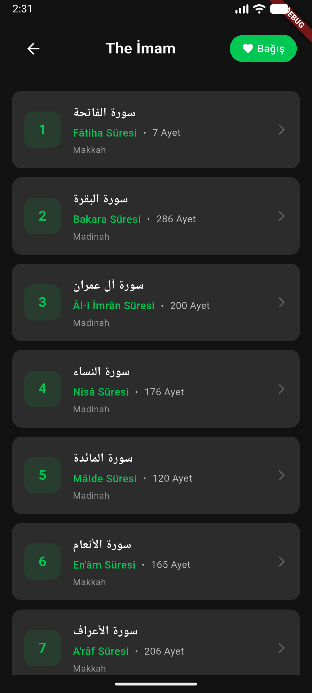
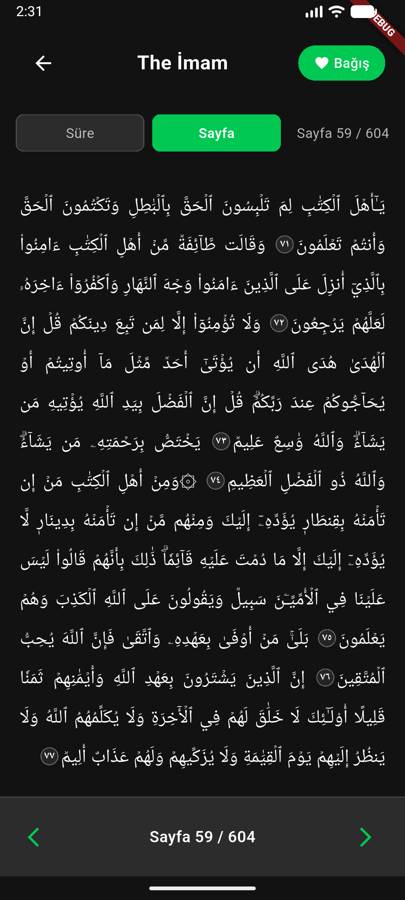

# THE IMAM - Islamic Law Assistant (Mobile App)

**Subtitle:** Software and Artificial Intelligence

Modern teknolojilerle dini içerikleri birleştiren **The Imam**, kullanıcıların İslami kaynaklardan doğru bilgilere hızlıca ulaşmasını sağlayan yenilikçi bir mobil uygulama. Bu proje, **Retrieval Augmented Generation (RAG)** teknolojisini kullanarak, geleneksel dini metinleri yapay zeka ile buluşturuyor. RAG, yapay zekanın bilgi kaynaklarından öğrenmesini ve kullanıcı sorularına kaynak göstererek cevap vermesini sağlayan bir yaklaşım.

## Proje Hakkında

**The Imam**, geniş bir İslami kaynak koleksiyonunu vektör tabanlı arama sistemi ile indeksleyen, kullanıcı sorularına kaynak göstererek cevap veren bir AI asistanı. Uygulama, Kuran-ı Kerim, Tefsir kitapları, Fıkıh eserleri ve diğer önemli İslami kaynakları içeren kapsamlı bir veritabanına sahiptir. OpenAI embeddings, ChromaDB ve LangChain/LangGraph gibi modern AI araçları kullanılarak geliştirilmiştir.

## Ana Özellikler

- 🤖 **AI Destekli Sohbet:** Kullanıcı sorularına Kuran, tefsir, fıkıh ve diğer İslami kaynaklardan cevap veren akıllı asistan
- 📚 **Kaynak Gösterimi:** Her cevap için ilgili sure ve ayet referansları
- 🔍 **Semantic Search:** Anlama dayalı vektör araması ile en ilgili içerikleri bulma
- 💬 **Sohbet Geçmişi:** Kullanıcı konuşmalarını MySQL veritabanında kaydetme ve yönetme
- 🔐 **JWT Authentication:** Token tabanlı güvenli kullanıcı kimlik doğrulama
- 📱 **Modern Mobil Arayüz:** Flutter ile geliştirilmiş kullanıcı dostu tasarım

---

---

## Nasıl Çalışıyor?

The Imam, iki ana parçadan oluşuyor: **mobil uygulama** (Flutter ile geliştirildi) ve **sunucu tarafı** (Python ile yazıldı).

## Sunucu Tarafı (Backend)

Backend, **Python** ve **FastAPI** framework'ü ile geliştirildi. Sistem, kullanıcı sorularını alıp, İslami kaynaklarda arama yapıyor ve cevapları hazırlıyor. Temel olarak şu adımları izliyor:

1. **Vektörleştirme (Embedding):** Tüm İslami metinler (Kuran, tefsir, fıkıh vb.) OpenAI'nin text-embedding-3-large modeli kullanılarak vektörlere dönüştürülüyor. Bu işlem, metinleri sayısal değerlere çevirerek bilgisayarın anlayabileceği forma getiriyor. Uzun metinler, RecursiveCharacterTextSplitter kullanılarak yaklaşık 50,000 karakterlik parçalara bölünüyor. Bu parçalama işlemi, OpenAI'nin token limitlerini aşmamak ve daha verimli arama yapabilmek için gerekli.

2. **Vektör Veritabanı (ChromaDB):** Vektörleştirilmiş metinler, ChromaDB adı verilen özel bir vektör veritabanına kaydediliyor. Her metin parçası, hangi sure, ayet veya kitaptan geldiğini gösteren metadata ile birlikte saklanıyor.

3. **Semantic Search (Anlama Dayalı Arama):** Kullanıcı bir soru sorduğunda, sistem önce bu soruyu vektörleştiriyor, sonra ChromaDB'de cosine similarity (kosinüs benzerliği) kullanarak en ilgili 3 kaynağı buluyor. Bu arama yöntemi, geleneksel kelime eşleştirmesinden farklı olarak metinlerin anlamına da bakıyor.

4. **LLM ile Cevap Oluşturma:** Bulunan kaynaklar, GPT-4o-mini modeline context olarak gönderiliyor ve kullanıcının sorusuna uygun bir cevap oluşturuluyor. LangChain ve LangGraph kütüphaneleri, bu süreci yönetiyor ve AI agent'ın kaynakları doğru şekilde kullanmasını sağlıyor.

## Mobil Uygulama (Frontend)

Mobil uygulama, **Flutter** framework'ü ile geliştirildi. **Dart** programlama dili kullanılarak yazıldı ve **Material Design 3** prensiplerine uygun olarak tasarlandı. Uygulama, **RESTful API** ile backend ile iletişim kuruyor. Kullanıcılar:

- Sorularını yazabiliyor
- Cevapları anlık olarak alabiliyor
- Kaynak linklerine tıklayarak ilgili bölümlere gidebiliyor
- SharedPreferences ile yerel olarak saklanan önceki konuşmalarını görebiliyor

---

## RAG Pipeline: İşleyiş Süreci

Sistem, **RAG (Retrieval Augmented Generation)** yaklaşımını kullanarak çalışıyor. Bu süreç şu adımlardan oluşuyor:

1. **Indexing (İndeksleme):** Tüm İslami metinler JSON formatından okunuyor, text chunking ile parçalara bölünüyor ve OpenAI embeddings API'si kullanılarak vektörleştiriliyor. Her chunk için metadata (sure numarası, ayet numaraları, kaynak bilgisi) saklanıyor.

2. **Query Processing:** Kullanıcı sorduğunda, soru da aynı şekilde vektörleştiriliyor.

3. **Retrieval:** ChromaDB'de similarity search yapılarak en ilgili 3 doküman bulunuyor. Bu işlem, cosine similarity metriği kullanılarak gerçekleştiriliyor.

4. **Generation:** Bulunan kaynaklar, LangChain üzerinden GPT-4o-mini modeline context olarak gönderiliyor. Model, bu kaynakları kullanarak kullanıcının sorusuna cevap oluşturuyor.

5. **Response:** Cevap, kaynak metadata'sı ile birlikte kullanıcıya döndürülüyor. Frontend'te, bu kaynaklar tıklanabilir linkler olarak gösteriliyor.

---

**Technologies:** FastAPI, LangChain, Flutter, MySQL

